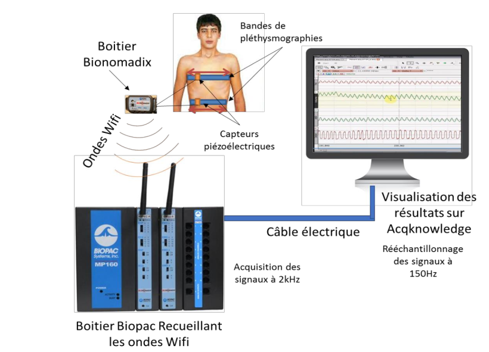
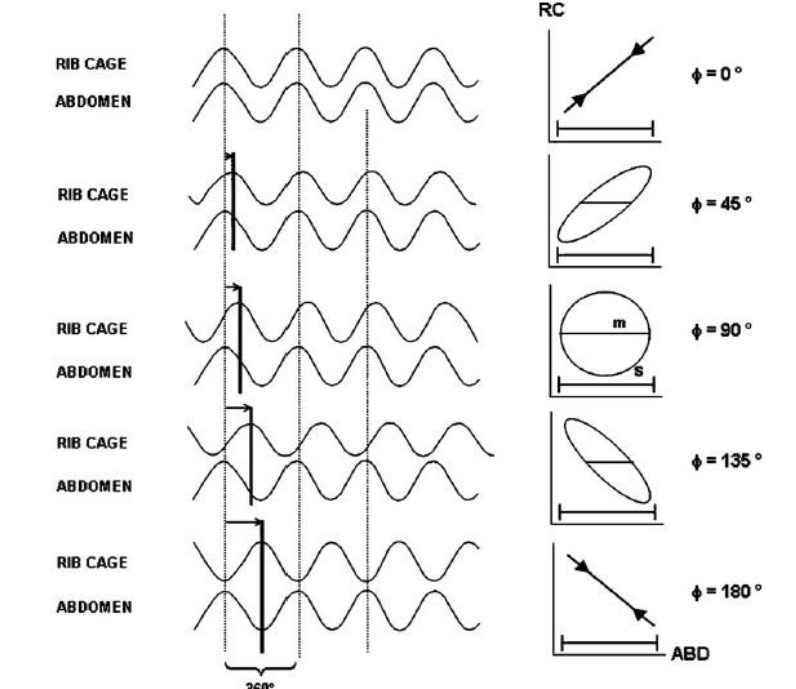
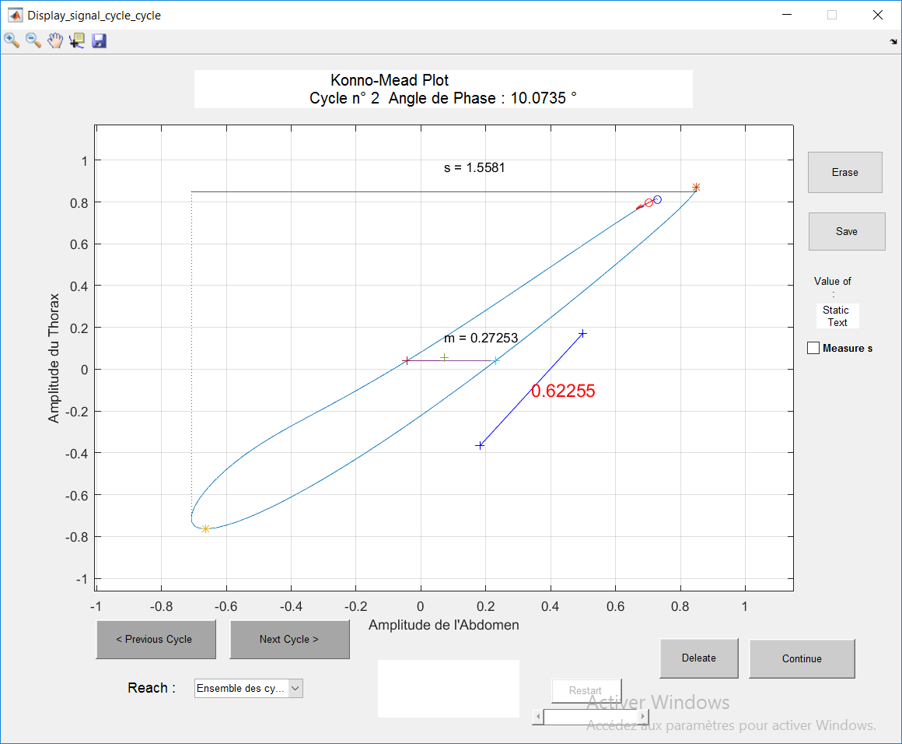

# Scripts pour l'étude de la respiration aux moyen de bandes de pléthysmographies.

ce projet contient :
- [les scripts permettant de calibrer les bandes de pléthysmographie pour la](excel_tool/)
- [les scripts permettant de calculer l'angle de phase (Konno & Mead)](matlab_tools)

# 1. Calibrations de bandes_plethysmographies pour l'estimation du volume courant
Calibrations de bandes de plethysmographies

Scripts pour la calibration de bandes de pléthysmographies.
Après acquisition des signaux; un script vba a été produit pour la segmentation de signaux respiratoires (detection de pics) pour la mesure du volume courant

## Bandes de pléthysmographies

**Necessite Microsoft Excel**

## Importer les données d’Acqknowledge à Excel :quelques recommandations …

- Appliquer des filtres passe bas de fréquence de coupure 1 Hz (FIR) pour les signaux du Thorax et de l’Abdomen

- Eliminer une éventuelle ligne de base en soustrayant les signaux à leurs moyennes

- Ré-échantillonner les données à une fréquence de 100 – 150 Hz pour pouvoir les sauver sur un fichier Excel

## Méthode de calibration des bandes de pléthysmographie: Régression Linéaire Multiple

eq. 𝑉_𝑇=𝛼×𝑇_𝑎𝑏𝑑+𝜏× 𝑇_𝑡ℎ𝑜+𝐶𝑠𝑡𝑒

1. Etape 1 : Détermination des variables 𝛼, 𝜏 et 𝐶𝑠𝑡𝑒 pour construire le modèle
2. Etape 2 : Utiliser le modèle pour calculer le volume courant prédit (𝑉_𝑇) au moyen de 𝑇_𝑎𝑏𝑑 et 𝑇_𝑡ℎ𝑜 uniquement. 

## Protocole

### 1. Calibration des bandes de pléthysmographies

### 2. Utilisation des bandes de pléthysmographies

## Résultats

Representation des signaux du thorax et de l'abdomen 

### Regression lineaire

### Comparaison avec un réseaux de neurones

### Résultats des prédictions

# 2. Calcul de l'angle de phase

Mesure du déphasage moyen entre les sisgnaux du thorax et de l'abdomen.
L'angle de phase est un indicateur de la qualité de la respiration.
Plus l'angle de déphasage est grand plus la détresse respiratoire est importante.

Cet angle de phase est calculé en mesurant les distances $m$ et $s$ representées sur la conique, où:
- $m$ est l’épaisseur de la conique à mi-hauteur
- $s$ l’épaisseur de la conique
- $\phi$ l'angle de phase

$$\phi=\left\lbrace{\pi - arcsin(\frac{m}{s}), \text{ if } \phi < 90 \text{ deg}\atop arcsin(\frac{m}{s})\text{ otherwise.}}\right.$$ 

Les signaux du thorax et de l'abdomen sont segmentés cycle par cycle au moyen d'une [détection des extrema par prééminance](https://fr.mathworks.com/help/signal/ref/findpeaks.html).

Exemple de signaux obtenus et mesures associées:

