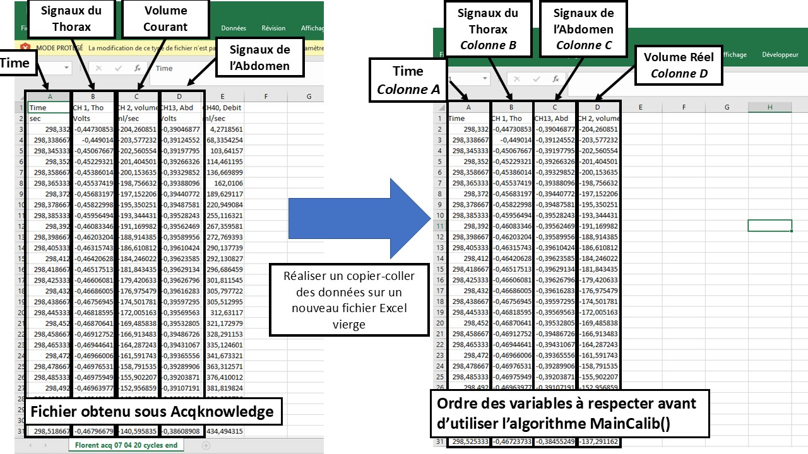
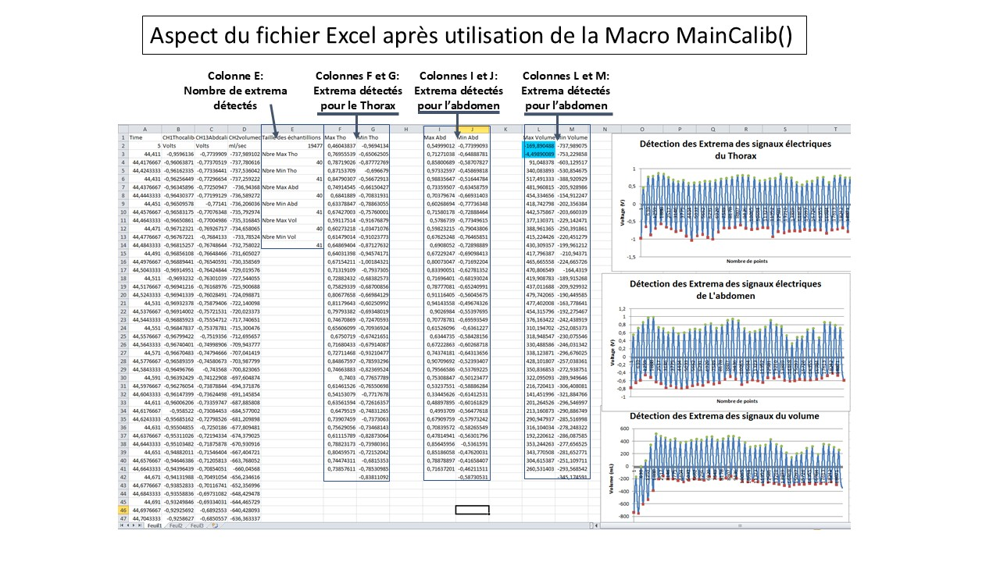
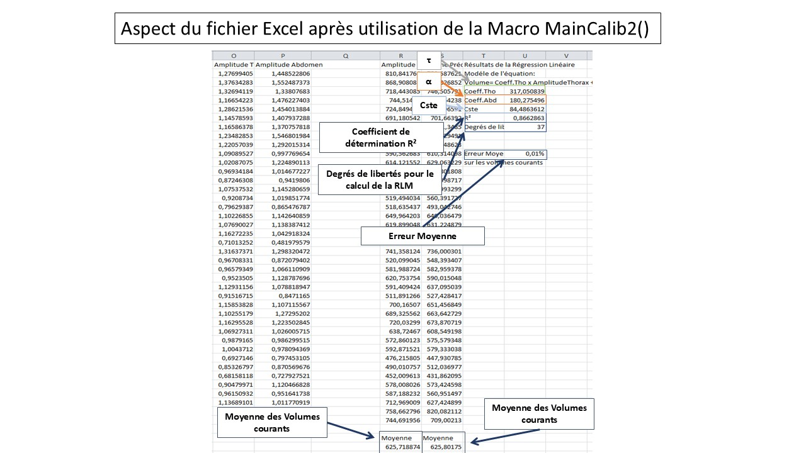
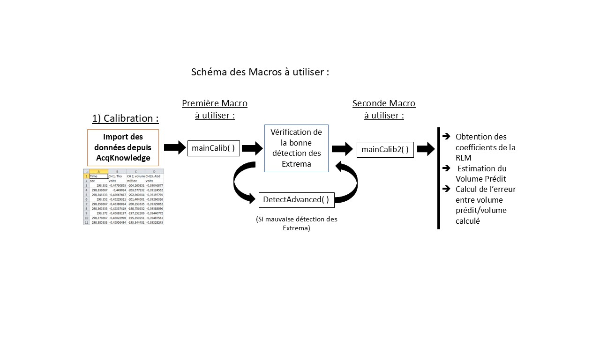
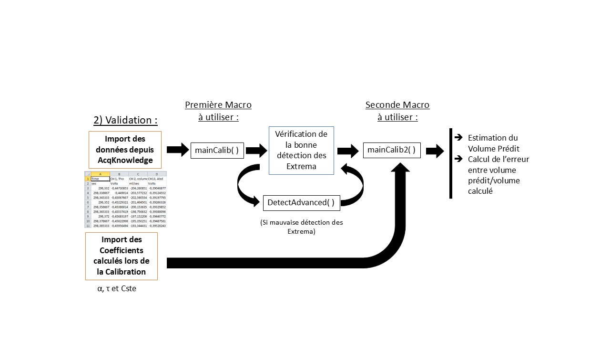
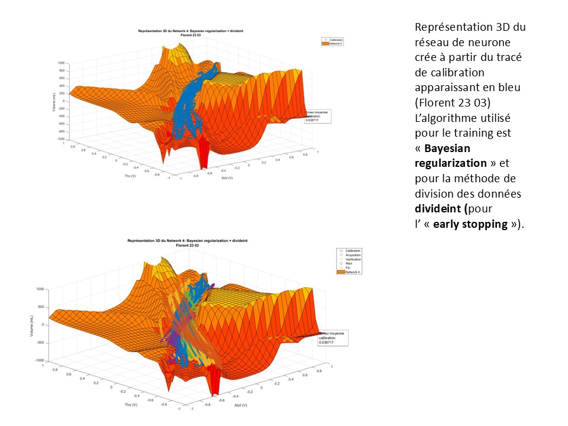
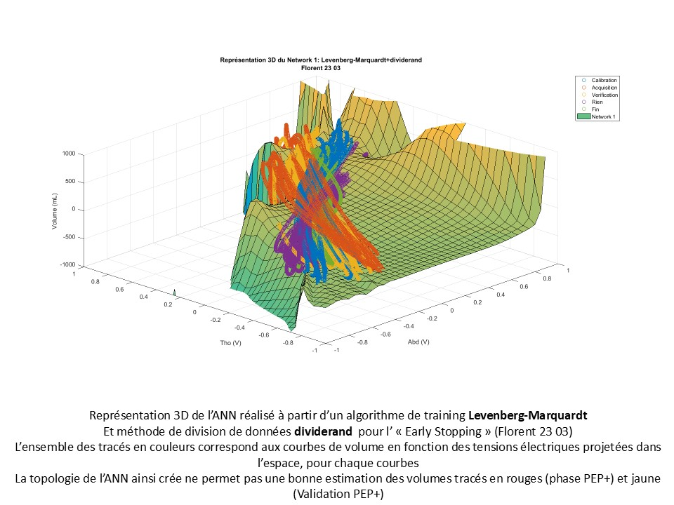
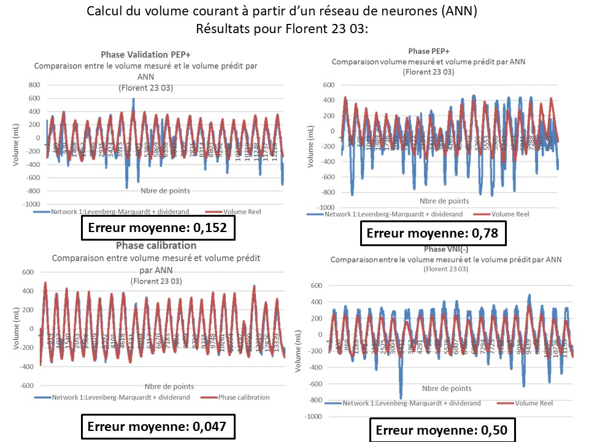

# Calibrations de bandes_plethysmographies
Calibrations de bandes de plethysmographies

Scripts pour la calibration de bandes de pléthysmographies.
Après acquisition des signaux; un script vba a été produit pour la segmentation de signaux respiratoires (detection de pics) pour la mesure du volume courant

**Necessite Microsoft Excel**

## Importer les données d’Acqknowledge à Excel :quelques recommandations …

- Appliquer des filtres passe bas de fréquence de coupure 1 Hz (FIR) pour les signaux du Thorax et de l’Abdomen

- Eliminer une éventuelle ligne de base en soustrayant les signaux à leurs moyennes

- Ré-échantillonner les données à une fréquence de 100 – 150 Hz pour pouvoir les sauver sur un fichier Excel

## Méthode de calibration des bandes de pléthysmographie : Régression Linéaire Multiple

eq. 𝑉_𝑇=𝛼×𝑇_𝑎𝑏𝑑+𝜏× 𝑇_𝑡ℎ𝑜+𝐶𝑠𝑡𝑒

1. Etape 1 : Détermination des variables 𝛼, 𝜏 et 𝐶𝑠𝑡𝑒 pour construire le modèle
2. Etape 2 : Utiliser le modèle pour calculer le volume courant prédit (𝑉_𝑇) au moyen de 𝑇_𝑎𝑏𝑑 et 𝑇_𝑡ℎ𝑜 uniquement. 

## Protocole

### 1. Calibration des bandes de pléthysmographies

### 2. Utilisation des bandes de pléthysmographies

## Résultats

Representation des signaux du thorax et de l'abdomen 

### Regression lineaire

### Comparaison avec un réseaux de neurones

### Résultats des prédictions

